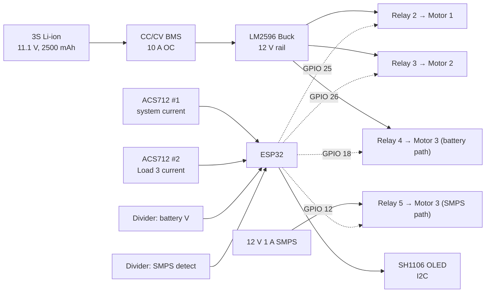
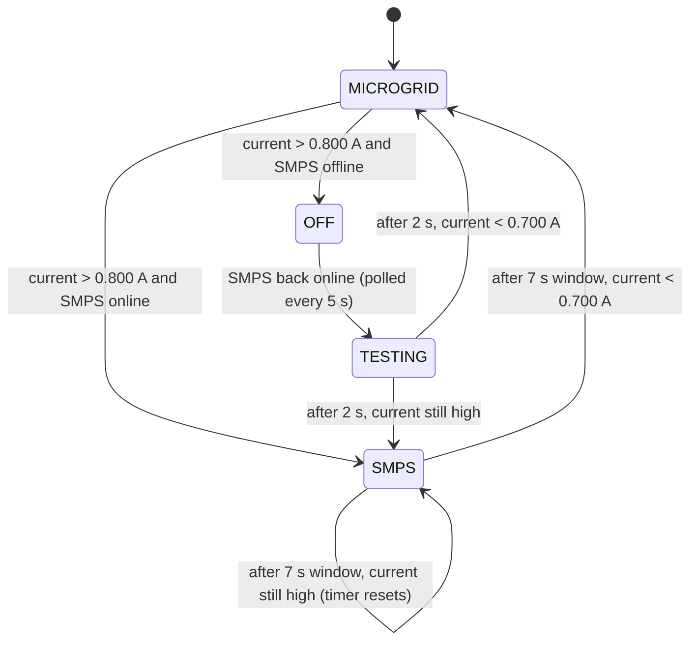

# microgrid-esp32-controller
# Intelligent Predictive Protection and Optimisation System for Microgrids

A low-cost (about USD 34) **ESP32-based DC microgrid controller** with staged load energisation, per-load current monitoring, automatic source transfer, and a real-time OLED status display. Built and tested as a physical prototype on a 12 V DC bus with a 3S Li-ion pack and three 775-series DC motors.

> **B.Tech Capstone Project**, Electrical Engineering, School of Electrical and Electronics Engineering, Lovely Professional University, Phagwara, Punjab, India (2026)
> **Authors:** Talent Tapuwanashe Mapara, Gerald Tatenda Muzembe, Diamon Tawanda Phiri
> **Supervisor:** Dr. Neha Ahuja, Assistant Professor

## Problem

Entry-level solar microgrid controllers for off-grid households typically lack three capabilities:

1. **Staged load energisation** to contain motor startup inrush current (which can trip the battery's BMS).
2. **Per-load current monitoring** with automatic transfer to a supplementary source.
3. **Hysteresis-governed recovery** that prevents relay chatter when current hovers near a threshold.

This project implements all three on a single ESP32, with commodity parts and no RTOS.

## Key Features

- **Sequential load engagement:** Load 1 at t = 10 s, Load 2 at t = 20 s, Load 3 at t = 30 s, using non-blocking `millis()` timing.
- **Dual-relay source switching for Load 3:** powered from the battery rail by default (Relay 4) and automatically moved to a supplementary 12 V SMPS (Relay 5) when its current exceeds **0.800 A**. Break-before-make switching ensures both sources are never connected at once.
- **Hysteresis recovery:** Load 3 returns to the battery only after the current is below **0.700 A** following a **7 s** stability window.
- **Load shedding and restoration:** if overcurrent occurs while the SMPS is offline, Load 3 is shed, the SMPS is polled every 5 s, and on return Load 3 is test-connected before being routed back.
- **Live monitoring:** battery voltage, SMPS status, system current, Load 3 current, and relay states on an **SH1106 OLED** (U8g2), plus a serial telemetry line each cycle.
- **Averaged sensing:** 200-sample ADC averaging for the ACS712 current sensors (about 14x noise reduction) and 50 samples for voltage.

## Results 

Bench measurements from the project report (25 °C, fully charged 3S pack):

| Test | Result |

| Peak inrush, simultaneous vs sequential | 8.21 A → 3.87 A (**−52.8%**) |

| BMS overcurrent trips | 4/5 runs (simultaneous) → **0/5** (sequential) |

| Source handover latency (n = 10) | **2,184 ms** average (dominated by the 2 s dead-time) |

| Load 3 current after handover | 0.523 A average (below both thresholds in 10/10 trials) |

| Hysteresis test (n = 16 trials) | **0 oscillatory switching events**; recovery in 8/8 sustained cases, 0/8 for 4 s dips |

| ACS712 accuracy after calibration | Max error 0.010 A (within 2% of Fluke 115 reference) |

| Total component cost | about **USD 34** |

## System Architecture



## Hardware

### Bill of Materials

| Component | Specification | Qty | Cost (USD) |


| ESP32 Dev Board | Dual-core 240 MHz, 12-bit ADC | 1 | 4.50 |

| 3S BMS module | CC/CV, 12.6 V max, 10 A OC protection | 1 | 2.80 |

| 3S Li-ion pack | 11.1 V nominal, 2500 mAh (18650 x 3) | 1 | 6.00 |

| HW-688 buck converter | LM2596, 12 V out, 3 A | 1 | 1.20 |

| 4-channel relay module | 5 V coil, 10 A, opto-isolated, active-LOW | 1 | 2.50 |

| 775 DC motor | 12 V, about 3000 RPM no-load | 3 | 6.00 |

| ACS712 5A | 185 mV/A, ±5 A | 2 | 3.00 |

| SH1106 OLED | 128x64, I2C | 1 | 2.00 |

| SMPS | 12 V 1 A regulated adapter | 1 | 3.50 |

| Misc. | Resistors, capacitors, breadboard, wires | n/a | about 2.30 |

### Pin Allocation

| GPIO | Type | Signal |

| 35 | ADC in | System current (ACS712 #1) |

| 33 | ADC in | Load 3 current (ACS712 #2) |

| 34 | ADC in | Battery voltage (divider) |

| 32 | ADC in | SMPS detect voltage (divider) |

| 25 | Digital out (active LOW) | Relay 2, Load 1 |

| 26 | Digital out (active LOW) | Relay 3, Load 2 |

| 18 | Digital out (active LOW) | Relay 4, Load 3 battery path |

| 12 | Digital out (active LOW) | Relay 5, Load 3 SMPS path |

| 21 / 22 | I2C | OLED SDA / SCL (address 0x3C) |

### Wiring Notes

- Voltage dividers: R1 = 27 kΩ (high side), R2 = 10 kΩ (to ground), 100 nF at the ADC node. The firmware applies a **3.64x** scale factor.
- Each relay IN pin connects to its GPIO through a 470 Ω resistor; the relay module is powered from the ESP32 VIN (5 V).
- Relay outputs are initialised **HIGH** (loads off) in `setup()` so that boot glitches cannot energise loads.
- Load 3's current sensor sits downstream of both Relay 4 and Relay 5, so it reads Load 3 current whichever source is active.


### Load 3 state machine



### Key thresholds

| Constant | Value | Purpose |

| `L3_CURRENT_HIGH` | 0.800 A | Forward switch threshold |

| `L3_CURRENT_THRESHOLD` | 0.700 A | Recovery threshold (0.100 A hysteresis band) |

| `STABILITY_WINDOW` | 7000 ms | Settle time before the return check |

| `SMPS_VOLTAGE_THRESHOLD` | 1.5 V | SMPS considered online (at the divider output) |

| `SMPS_CHECK_INTERVAL` | 5000 ms | SMPS polling period while Load 3 is shed |

### Display layout

```
BAT:12.4V   SMPS:ON
---------------------
SYS: 1.260A
L3: 0.412A
---------------------
L1:ON  L2:ON
L3:ON(GRID)
```

### Why U8g2 and not Adafruit SSD1306?

The SH1106 and SSD1306 OLED controllers have different internal memory layouts (132 vs 128 columns). The Adafruit SSD1306 library renders SH1106 panels shifted by two pixels. The U8g2 `U8G2_SH1106_128X64_NONAME_F_HW_I2C` constructor handles this correctly. If you use an SSD1306 panel instead, change the constructor accordingly.

## Calibration

ACS712 modules vary from unit to unit. Calibrate yours before relying on the thresholds:

1. Power up with **no loads connected**. The sketch captures the zero-current sensor voltage at boot.
2. Compare readings against a reference multimeter at several known currents.
3. Adjust `OFFSET_SYS` and `OFFSET_L3` until the zero-load reading is 0 and the readings match your reference. The report used `OFFSET_SYS = 0.05 A` and `OFFSET_L3 = 0.29 A`.
4. Adjust the `3.64` divider factor in `getVoltage()` until the battery reading matches the multimeter.

Values are hard-coded and unit-specific; they will need to be re-derived for different hardware.

## Limitations and Future Work

- **No SMPS quality check:** any voltage above 1.5 V at the detect pin counts as "online", so an under-voltage supply (for example 6 V) would be accepted. A post-handover bus-voltage check (about 10.5 V minimum) is recommended.
- **Single-sample zero calibration** at boot is vulnerable to power-on transients; a 200-sample average is more robust.
- **Calibration constants are hard-coded.** Store them in ESP32 NVS so they survive reflashing.
- **No staged under-voltage load shedding:** loads stay connected until the BMS cuts everything (reported at 9.0 V).
- Planned extensions: Wi-Fi/MQTT telemetry, a real MPPT charge controller with a PV panel, custom PCB, and source switching on all three loads.

## Scope Note

The prototype implements deterministic, threshold-based protection and optimisation logic on the ESP32. Machine-learning-based prediction and Wi-Fi/IoT telemetry are not part of the current firmware; the ESP32's wireless capability provides a path for adding them (see Future Work).

## References

- Allegro MicroSystems (2013). *ACS712 Hall Effect-Based Linear Current Sensor IC* datasheet.
- Espressif Systems (2023). *ESP32 Technical Reference Manual*.
- Kraus, O. (2024). *U8g2: Library for Monochrome Displays*. https://github.com/olikraus/u8g2
- Salomonsson, D., & Sannino, A. (2008). Low-voltage DC distribution system for commercial power systems with sensitive electronic loads. *IEEE Transactions on Power Delivery*.
- Texas Instruments (2013). *LM2596 SIMPLE SWITCHER* datasheet.
- IEEE Std 2030.7 (2017). *Specification of Microgrid Controllers*.

